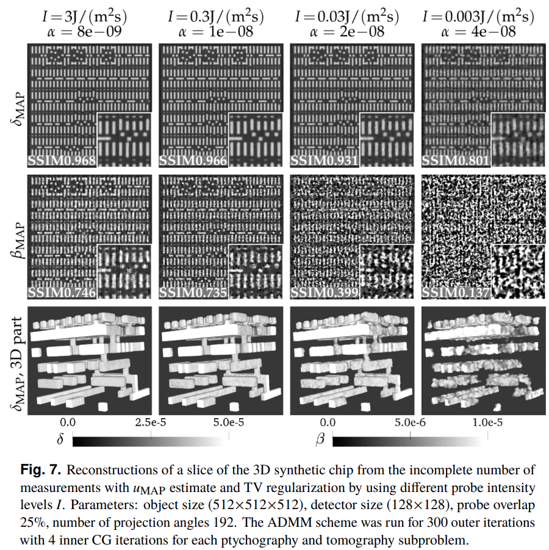

================
PtychoTomo
================
**ptychotomo** is a CuPy and CUDA FFT based library for ptychography and tomography ADMM (Augmented Lagrangian method of multipliers) solvers. For details, see
Nikitin, Viktor, et al. "Photon-limited ptychography of 3D objects via Bayesian reconstruction." OSA Continuum 2.10 (2019): 2948-2968.

The software implements a Bayesian framework for the ptychotomographic imaging of 3D objects under photon-limited conditions. This approach is significantly more robust to measurement noise by incorporating prior information on the probabilities of the object features and the
measurement process into the reconstruction problem, and it can improve both the temporal and
spatial resolution of current and future ptychography instruments. ADMM scheme is used to
solve the proposed optimization problem, where the ptychography and tomography subproblems are both solved using the conjugate-gradient method. 

Example of reconstruction:

================
Installation
================
From source::

  export CUDACXX=path-to-cuda-nvcc
  pip install .

Dependency:

CuPy - for GPU acceleration of linear algebra operations in iterative schemes.
See (https://cupy.chainer.org/). For installation use::
  conda install cupy
  
Test:
  python test.py 
  
================
Developers
================
Viktor Nikitin (vnikitin@anl.gov)
Daniel J. Ching (dching@anl.gov)
